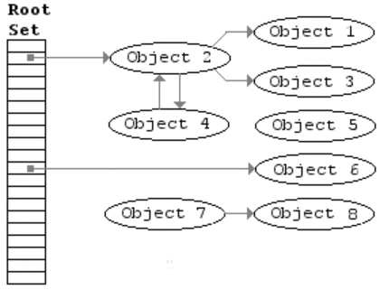

# JavaScript: The Advanced Concepts Study Notes (Live)

## Table of Contents

- [JavaScript: The Advanced Concepts Study Notes (Live)](#javascript-the-advanced-concepts-study-notes-live)
  - [Table of Contents](#table-of-contents)
  - [**Section 2: JavaScript Foundation**](#section-2-javascript-foundation)
    - [Javascript Engine](#javascript-engine)
    - [Inside the Engine](#inside-the-engine)
    - [Interpreters and Compilers](#interpreters-and-compilers)
    - [Babel + TypeScript](#babel--typescript)
    - [Inside the V8 Engine](#inside-the-v8-engine)
    - [Comparing Other Languages](#comparing-other-languages)
    - [Writing Optimized Code](#writing-optimized-code)
    - [WebAssembly](#webassembly)
    - [Call Stack and Memory Heap](#call-stack-and-memory-heap)
    - [Stack Overflow](#stack-overflow)
    - [Garbage Collection](#garbage-collection)
    - [Memory Leaks](#memory-leaks)
    - [Single Threaded](#single-threaded)
    - [Javascript Runtime](#javascript-runtime)
    - [Node.js](#nodejs)
    - [Advanced JavaScript Cheatsheet](#advanced-javascript-cheatsheet)
  - [**Section 3: Javascript Foundation II**](#section-3-javascript-foundation-ii)
    - [Execution Context](#execution-context)
    - [Lexical Environment](#lexical-environment)
    - [Hoisting](#hoisting)
    - [Function Invocation](#function-invocation)
    - [arguments Keyword](#arguments-keyword)
    - [Variable Environment](#variable-environment)
    - [Scope Chain](#scope-chain)
    - [[[scope]]](#scope)
    - [JS is Weird](#js-is-weird)
    - [Function Scope vs Block Scope](#function-scope-vs-block-scope)
    - [Global Variables](#global-variables)
    - [IIFE](#iife)
    - [this Keyword](#this-keyword)
    - [Dynamic Scope vs Lexical Scope](#dynamic-scope-vs-lexical-scope)
    - [call(), apply(), bind()](#call-apply-bind)
    - [bind() and currying](#bind-and-currying)
    - [Context vs Scope](#context-vs-scope)
  - [**Section 4: Types in JavaScript**](#section-4-types-in-javascript)
    - [Javascript Types](#javascript-types)
    - [Array.isArray()](#arrayisarray)
    - [Pass By Value vs Pass By Reference](#pass-by-value-vs-pass-by-reference)
    - [Exercise: Compare Objects](#exercise-compare-objects)
    - [Exercise: Pass By Reference](#exercise-pass-by-reference)
    - [Type Coercion](#type-coercion)
  - [**Section 5: The 2 Pillars: Closures and Prototypal Inheritance**](#section-5-the-2-pillars-closures-and-prototypal-inheritance)
    - [Functions are callable Objects](#functions-are-callable-objects)
    - [First Class Citizens](#first-class-citizens)
    - [Extra Bits: Functions](#extra-bits-functions)
    - [Higher Order Functions](#higher-order-functions)
    - [Closures](#closures)
    - [Closures and Memory](#closures-and-memory)
    - [Closures and Encapsulation](#closures-and-encapsulation)
    - [Closures Exercises and Solutions](#closures-exercises-and-solutions)
    - [Prototypal Inheritance](#prototypal-inheritance)
    - [Inherit the properties of parent object](#inherit-the-properties-of-parent-object)
    - [Check proprties](#check-proprties)
    - [Create our own prototypes](#create-our-own-prototypes)
    - [Only functions has prototype property](#only-functions-has-prototype-property)
    - [Exercise - extend the functionality of a built in object](#exercise---extend-the-functionality-of-a-built-in-object)
    - [Prototypal Inheritance with this](#prototypal-inheritance-with-this)
    - [Section Review](#section-review)

## **Section 2: JavaScript Foundation**

### Javascript Engine

- [List of ECMAScript engines](https://en.wikipedia.org/wiki)
- [V8 JavaScript engine](https://v8.dev/)
- [Brendan Eich](https://en.wikipedia.org/wiki/Brendan_Eich)
- [SpiderMonkey](https://developer.mozilla.org/en-US/docs/Mozilla/Projects/SpiderMonkey)
- [What’s the difference between JavaScript and ECMAScript?](https://www.freecodecamp.org/news/whats-the-difference-between-javascript-and-ecmascript-cba48c73a2b5/)

**[⬆ back to top](#table-of-contents)**

### Inside the Engine


- [AST Explorer](https://astexplorer.net/)
- [JavaScript engine fundamentals: Shapes and Inline Caches](https://mathiasbynens.be/notes/shapes-ics)
- [What happens inside JavaScript Engine ?](https://www.geeksforgeeks.org/what-happens-inside-javascript-engine/)
- [How JavaScript works](https://blog.sessionstack.com/how-does-javascript-actually-work-part-1-b0bacc073cf)

```javascript
const jsengine = code => code.split(/\s+/)
jsengine('var a = 5')
```

**[⬆ back to top](#table-of-contents)**

### Interpreters and Compilers

- Interpreter directly executes the instructions in the source programming language 
- compiler translates instructions into efficient machine code
  - take one language and convert into a different one
- [Compilers and Interpreters](https://medium.com/hackernoon/compilers-and-interpreters-3e354a2e41cf)
- [A Deeper Inspection Into Compilation And Interpretation](https://medium.com/basecs/a-deeper-inspection-into-compilation-and-interpretation-d98952ebc842)
- [Inside the Javascript Engine: Compiler and Interpreter](https://medium.com/@allansendagi/inside-the-javascript-engine-compiler-and-interpreter-c8faa638b0d9)

**[⬆ back to top](#table-of-contents)**

### Babel + TypeScript

Javascript compiler

- [Babel](https://babeljs.io/)
- [TypeScript](https://www.typescriptlang.org/)

**[⬆ back to top](#table-of-contents)**

### Inside the V8 Engine

JIT compiler = Interpreter + Compiler

- It all starts with the JavaScript code you write. The JavaScript engine parses the source code and turns it into an Abstract Syntax Tree (AST). Based on that AST, the interpreter can start to do its thing and produce bytecode. Great! At that point the engine is actually running the JavaScript code.
- To make it run faster, the bytecode can be sent to the optimizing compiler along with profiling data. The optimizing compiler makes certain assumptions based on the profiling data it has, and then produces highly-optimized machine code.
- If at some point one of the assumptions turns out to be incorrect, the optimizing compiler deoptimizes and goes back to the interpreter.

**[⬆ back to top](#table-of-contents)**

### Comparing Other Languages

- Executable file: The product of the linking process. They are machine code which can be directly executed by the CPU.
- [Machine code vs. Byte code vs. Object code vs. Source code vs. Assembly code vs. Executable code](https://medium.com/@rahul77349/machine-code-vs-byte-code-vs-object-code-vs-source-code-vs-assembly-code-812c9780f24c)

**[⬆ back to top](#table-of-contents)**

### Writing Optimized Code

Memoization is a way to cache a return value of a funcBon based on its parameters. This makes the funcBon that takes a long Bme run much faster aoer one execuBon. If the parameter changes, it will sBll have to reevaluate the funcBon.

[Javascript Hidden Classes and Inline Caching in V8](https://richardartoul.github.io/jekyll/update/2015/04/26/hidden-classes.html)
[Optimizing dynamic JavaScript with inline caches](https://github.com/sq/JSIL/wiki/Optimizing-dynamic-JavaScript-with-inline-caches)

Here are a few things you should avoid when writing your code if possible: 

- eval()
- arguments
- for in
- with 
- delete

There are a few main reasons these should be avoided. 

- Hidden classes
- Inline caching

```javascript
// Inline caching
const findUser = user => `Found ${user.firstName} ${user.lastName}`;

const userData = {
  firstName: 'Johnson',
  lastName: 'Junior'
}

// Code that executes the same method repeatedly will run faster than code that executes many different methods only once (due to inline caching).
findUser(userData)
```

```javascript
// Hidden classes
function Animal(x, y) {
//   Always instantiate your object properties in the same order so that hidden classes, and subsequently optimized code, can be shared.
  this.x = x;
  this.y = y;
}

const obj1 = new Animal(1,2);
const obj2 = new Animal(3,4);

// Adding properties to an object after instantiation will force a hidden class change and slow down any methods that were optimized for the previous hidden class. Instead, assign all of an object’s properties in its constructor.
obj1.a = 30;
obj1.b = 100;
obj2.b = 30;
obj2.a = 100;
```

**[⬆ back to top](#table-of-contents)**

### WebAssembly

Why not just use machine code from the beginning?
- Compile code ahead of time or even just compiling the code on the browser was not feasiblea at all because back in the day that was really really slow
- Impossible all the browsers agree on an executable format to run javascript

In the future

- [WebAssembly](https://webassembly.org/)
- Standard binary executable format

**[⬆ back to top](#table-of-contents)**

### Call Stack and Memory Heap

- Memory Heap: store and write information
- Call Stack: keep track of where we are in the code

```javascript
// memory heap

const number = 610; // allocate memory for number
const string = 'some text'; // allocate memory for a string
const human = { // allocate memory for an object and its value
  first: 'Chester',
  last: 'Heng'
};

const subtractTwo = num => num - 2;
const calculate = () => subtractTwo(4 + 5)

// call stack - FILO
// subtractTwo
// calculate
// Global Execution Context
```

**[⬆ back to top](#table-of-contents)**

### Stack Overflow

```javascript
// When a function calls itself,
// it is called RECURSION
function inception() {
  inception();
}

inception();
// returns Uncaught RangeError:
// Maximum call stack size exceeded
```

**[⬆ back to top](#table-of-contents)**

### Garbage Collection

- [Memory Management](https://developer.mozilla.org/en-US/docs/Web/JavaScript/Memory_Management)
- [Garbage collection](https://javascript.info/garbage-collection)
- [Understanding JavaScript Memory Management using Garbage Collection](https://medium.com/front-end-weekly/understanding-javascript-memory-management-using-garbage-collection-35ed4954a67f)



```javascript
var person = {
  first: "Brittney",
  last: "Postma"
};
person = "Brittney Postma";
```

**[⬆ back to top](#table-of-contents)**

### Memory Leaks

- [Garbage Collection in Redux Applications](https://developers.soundcloud.com/blog/garbage-collection-in-redux-applications)
- [Global object](https://developer.mozilla.org/en-US/docs/Glossary/Global_object)

```javascript
// infinite loop
let array = []
for (let i = 5; i > 1; i++) {
  array.push(i-1)
}

// global variable
var a = 1;
var b = 1;
var c = 1;

 var person = {
 first: "Brittney",
 last: "Postma"
 };
person = "Brittney Postma";

// event listeners
var element = document.getElementById('button')
element.addEventListener('click', onClick)

// setInterval
setInterval(() => {
  // reference objec
})
```

**[⬆ back to top](#table-of-contents)**

### Single Threaded

- Only one thing can be executed at a time 
- Javascript only has one call stack 
- Javascript is a synchronous language
  - Imagine an alert on the page
  - Block the user from accessing any part of the page until the OK button is clicked

This is where concurrency and the event loop come in.

**[⬆ back to top](#table-of-contents)**

### Javascript Runtime

- [The Javascript Runtime Environment](https://medium.com/@olinations/the-javascript-runtime-environment-d58fa2e60dd0)
- [JS Runtime Playground](http://latentflip.com/loupe)
- [Web APIs](https://developer.mozilla.org/en-US/docs/Web/API)
  - see window global object for all Web APIs methods
- All synchronous code will be pushed to Call Stack and execute in sequence
- Asynchronous Web APIs code will be executed by browser in the background in sequence
- Browser will store all Callback functions in Callback Queue
- Event Loop check for empty Call Stack to make sure all synchronous code has completed execution
  - Push Callback functions in Callback Queue to Call Stack and start execution

**[⬆ back to top](#table-of-contents)**

### Node.js

Summary

- I/O Intensive
- Non-blocking I/O

References

- [Introduction to Node.js / A beginners guide to Node.js and NPM](https://itnext.io/introduction-to-node-js-a-beginners-guide-to-node-js-and-npm-eca9c408f9fe)
- [How Node.js Works](https://www.youtube.com/watch?v=jOupHNvDIq8)
- [How Node JS Works?](https://www.youtube.com/watch?v=YSyFSnisip0)
- [Global Objects](https://nodejs.org/api/globals.html#globals_global_objects)
- [10 Things I Regret About Node.js](https://www.youtube.com/watch?v=M3BM9TB-8yA)

**[⬆ back to top](#table-of-contents)**

### Advanced JavaScript Cheatsheet

- [JavaScript Cheat Sheet: The Advanced Concepts](https://zerotomastery.io/courses/advanced-javascript/cheatsheet/)
- [JavaScript Cheat Sheet: The Advanced Concepts PDF](ztm-javascript-cheatsheet.pdf)

**[⬆ back to top](#table-of-contents)**

## **Section 3: Javascript Foundation II**

### Execution Context

Global Execution Context

Creation Phase

- Global object created: window
- Initializes this keyword to global
- window === this

Executing Phase

- Variable Environment created - memory space for var variables and functions created
- Initializes all variables to undefined (also known as hoistng) and places them with any functions into memory

```javascript
this;
window;
this === window;
```

**[⬆ back to top](#table-of-contents)**

### Lexical Environment

- lexical environment: the scope or environment the engine is currently reading code in
  - a new lexical environment is created when curly brackets {} are used
- lexical scope: available data + variables where function was defined
- dynamic scope: where function is called

```javascript
function one() {
  var isValid = true;  // local env
  two();  // new execution context
}

function two() {
  var isValid; // undefined
}

var isValid = false; // global
one();

// two() isValid = undefined
// one() isValid = true
// global() isValid = false
// -------------------------
// call stack
```

**[⬆ back to top](#table-of-contents)**

### Hoisting

- Hoisting is the process of putting all variable and function declarations into memory during the compile phase   
  - functions are fully hoisted
  - var variables are hoisted and initialized to undefined
  - let and const variables are hoisted but not initialized a value

```javascript
var favouriteFood = "grapes";

var foodThoughts = function () {
  console.log("Original favourite food: " + favouriteFood);
  var favouriteFood = "sushi";
  console.log("New favourite food: " + favouriteFood);
};

foodThoughts()
```

```javascript
// Global Execution Context
// Creation Phase
var favouriteFood = undefined
var foodThoughts = undefined

// Executing Phase
favouriteFood = "grapes"
foodThoughts = function () {
  console.log("Original favourite food: " + favouriteFood);
  var favouriteFood = "sushi";
  console.log("New favourite food: " + favouriteFood);
}
```

```javascript
foodThoughts()
// Functional Execution Context
// Creation Phase
var favouriteFood = undefined

// Executing Phase
"Original favourite food: undefined"
favouriteFood = "sushi"
"New favourite food: sushi"
```

Avoid hoisting when possible. It can cause memory leaks and hard to catch bugs in your code. Use let and const as your go to variables.

**[⬆ back to top](#table-of-contents)**

### Function Invocation

```javascript
// Function Expression
var canada = () => console.log('cold')

// Function Declaration
function india() {
  console.log('warm')
}

// Function Invocation / Call / Execution
canada()
india()
```

Functional Execution Context

- Only when a function is invoked, does a function execution context get created

Creation Phase

- Argument object created with any arguments
- Initializes this keyword to point called or to the global object if not specified

Executing Phase

- Variable Environment created - memory space for variable and functions created
- Initializes all variables to undefined and places them into memory with any new functions

**[⬆ back to top](#table-of-contents)**

### arguments Keyword

```javascript
function showArgs(arg1, arg2) {
  console.log("arguments: ", arguments);
  console.log(Array.from(arguments));
}
showArgs("hello", "world");

function showArgs2(...args) {
  console.log("arguments: ", args);
  console.log(args[0], args[1]);
}
showArgs2("hello", "world");

function noArgs() {
  console.log("arguments: ", arguments);
}
noArgs();
```

**[⬆ back to top](#table-of-contents)**

### Variable Environment

```javascript
function two() {
  var isValid;
}

function one() {
  var isValid = true;
  two();
}

var isValid = false;
one()

// global execution context creation
// function two() { ... }
// function one() { ... }
// var isValid = undefined;

// global execution context execution
// var isValid = false;

// function one execution context creation
// var isValid = undefined;

// function one execution context execution
// var isValid = true;

// function two execution context creation
// var isValid = undefined;

// function two execution context execution
```

**[⬆ back to top](#table-of-contents)**

### Scope Chain

- Lexical Environment === [[scope]]
- outer scope === [[scope]]

```javascript
// Scope defines the accessibility of variables and functions in the code
// Global Scope is the outer most scope
function sayMyName() {
  var a = 'a';
  return function findName() {
    var b = 'b';
    console.log(a);
    return function printName() {
      var c = 'c';
      console.log(a);
      console.log(b);
      return 'Andrei Neagoie'
    }
  }
}

sayMyName()()()
```

**[⬆ back to top](#table-of-contents)**

### [[scope]]

```javascript
function a() { }

// window: {
//   a: f a() {
//     [[Scopes]] : [
//       Script { },
//       Global { }
//     ]
//   }
// }
```

**[⬆ back to top](#table-of-contents)**

### JS is Weird

```javascript
// Weird Javascript #1 - it asks global scope for height
// Global scope says: ummm... no but here I just created it for you.
// We call this leakage of global variables.
function weird() {
  height = 50
}

weird()
```

```javascript
// leakage of global variables is not allowed
'use strict'
function weird() {
  height = 50
}

weird()
```

```javascript
var heyhey = function doodle() {
  return "heyhey"
}

heyhey();
doodle(); // Error! because it is enclosed in its own scope.
```

**[⬆ back to top](#table-of-contents)**

### Function Scope vs Block Scope

```javascript
// Function Scope
function loop() {
  for( var i = 0; i < 5; i++) {
    console.log(i);
  }
  console.log(i)
}

// Block Scope
function loop2() {
  for( let i = 0; i < 5; i++) {
    console.log(i);
  }
  console.log(i)
}
```

**[⬆ back to top](#table-of-contents)**

### Global Variables

```javascript
// variable collisions
// all global variables are on the global execution context
// they overwrite each other
var z = 1;
var z = 2;
z
```

**[⬆ back to top](#table-of-contents)**

### IIFE

```javascript
// place all library code inside local scope 
// to avoid any namespace collisions
// function expression
// anonymous function
(function() {

})();

// cannot call function declaration immediately
function a(){}()

var script1 = (function() {
  function a() {
    return 5;
  }
  return {
    a: a
  }
})();
script1.a()
```

**[⬆ back to top](#table-of-contents)**

### this Keyword

this is the object that the function is a property of

```javascript
function a() {
  console.log(this) // this refer to window object
}

const b = () => console.log(this) // this refer to window object

a()
b()
```

```javascript
// gives methods access to their object
const obj = {
  name: 'Billy',
  sing: function() {
    return 'llala ' + this.name + '!'
  },
  singAgain: function() {
    return this.sing()
  }
}

obj.singAgain()
```

```javascript
// execute some code for multiple objects
function importantPerson() {
  console.log(this.name)
}

importantPerson() // this refer to window object

const name = 'Sunny';
const obj1 = { name: 'Cassy', importantPerson }
const obj2 = { name: 'Jacob', importantPerson }

obj1.importantPerson()  // Cassy
obj2.importantPerson()  // Jacob
```

```javascript
var b = {
  name: 'jay',
  say() {console.log(this)} 
}

var c = {
  name: 'jay',
  say() {return function() {console.log(this)}}
}

var d = {
  name: 'jay',
  say() {return () => console.log(this)}
}

b.say()   // this refer to b object
c.say()() // this refer to window object
d.say()() // this refer to b object
```

```javascript
const character = {
  name: 'Simon',
  getCharacter() {
    return this.name;
  }
};

const giveMeTheCharacterNOW = character.getCharacter.bind(character);
giveMeTheCharacterNOW()
```

**[⬆ back to top](#table-of-contents)**

### Dynamic Scope vs Lexical Scope

- lexical scope: available data + variables where function was defined
- dynamic scope: where function is called
  - this keyword is dynamic scope

| Lexical scope                 | Dynamic Scope                    |
| ----------------------------- | -------------------------------- |
| write-time                    | run-time                         |
| where a function was declared | where a function was called from |

```javascript
const a = function() {
  console.log('a', this)  // this refer to window object
  const b = function() {
    console.log('b', this)  // this refer to window object
    const c = {
      hi: function() {
        console.log('c', this)  /// this refer to c object
      }
    }
    c.hi()  
  }
  b()
}

a()
```

```javascript
const obj = {
  name: 'Billy',
  sing: function() {
    console.log('a', this) // refer to obj object
    const anotherFunc = function() {
      console.log('b', this) // refer to window object
    }
  }
}
obj.sing()
```

```javascript
const obj = {
  name: 'Billy',
  sing() {
    console.log('a', this) // refer to obj object
    // arrow function is lexical bound
    const anotherFunc = () => console.log('b', this)  // refer to obj object
    anotherFunc()
  }
}
obj.sing()
```

```javascript
const obj = {
  name: 'Billy',
  sing() {
    console.log('a', this) // refer to obj object
    const anotherFunc = function() {
      console.log('b', this) // refer to obj object
    }
    return anotherFunc.bind(this)
  }
}
obj.sing()()
```

```javascript
const obj = {
  name: 'Billy',
  sing() {
    console.log('a', this) // refer to obj object
    const self = this;
    const anotherFunc = function() {
      console.log('b', self)  // refer to obj object
    }
    return anotherFunc
  }
}
obj.sing()()
```

**[⬆ back to top](#table-of-contents)**

### call(), apply(), bind()

```javascript
function a() {
  console.log('hi')
}
a()
a.call()
a.apply()
```

```javascript
const wizard = {
  name: 'Merlin',
  health: 100,
  heal(num1, num2) {
    this.health += num1 + num2;
  }
}

const archer = {
  name: 'Robin Hood',
  health: 50
}

wizard.heal(10, 60)
// borrow heal method from wizard object
wizard.heal.call(archer, 50, 60)
wizard.heal.apply(archer, [20, 30])

// borrow heal method from wizard object
// call healArcher later on with archer object
const healArcher = wizard.heal.bind(archer, 50, 60);
healArcher()
```

```javascript
const array = [1,2,3];

function getMaxNumber(arr) {
  return Math.max.apply(null, arr);  
}

const getMaxNumber = arr => Math.max.apply(null, arr)

getMaxNumber(array)
```

**[⬆ back to top](#table-of-contents)**

### bind() and currying

- translates a function from callable as f(a, b, c) into callable as f(a)(b)(c)
- [Currying](https://javascript.info/currying-partials)
- [Currying: A Functional Alternative To fn.bind](https://derickbailey.com/2016/06/24/currying-a-functional-alternative-to-fn-bind/)

```javascript
function sum(a, b) {
  return a + b;
}

// curry(f) does the currying transform
function curry(f) { 
  return function(a) {
    return function(b) {
      return f(a, b);
    };
  };
}

let curriedSum = curry(sum);

curriedSum(1)(2);
```

```javascript
function multiply(a, b, c) {
  return a * b * c;
}

const multipleByTwo = multiply.bind(this, 2, 4);
console.log(multipleByTwo(4));

const multipleByThree = multiply.bind(this, 3, 5);
console.log(multipleByThree(4));
```

**[⬆ back to top](#table-of-contents)**

### Context vs Scope

- [Understanding Scope and Context in JavaScript](http://ryanmorr.com/understanding-scope-and-context-in-javascript/)
- Scope is function based
  - what is the variable access of a function when it is invoked?
  - What is in the variable environment?
  - scope refers to the visibility of variables
- Context is object based
  - what is the value of this keyword?
  - context is most often determined by how a function is invoked with the value of this keyword 

**[⬆ back to top](#table-of-contents)**

## **Section 4: Types in JavaScript**

### Javascript Types

[Standard built-in objects](https://developer.mozilla.org/en-US/docs/Web/JavaScript/Reference/Global_Objects)

```javascript
// Primitive
typeof 5
typeof true
typeof 'To be or not to be'
typeof undefined  // absent of definition 
typeof null // absent of value
typeof Symbol('just me')

// Non-Primitive
// has a reference or pointer
typeof {}
typeof []
typeof function() {}

const obj1 = {
  a: 'Tom'
}

// function and array are objects
function a() {
  return 5;
}
a.hi = "hi"

// Object wrapper
true.toString()
Boolean(true).toString()
```

**[⬆ back to top](#table-of-contents)**

### Array.isArray()

```javascript
const array = ['1', '2', '3'];
const obj = {
  0: '1',
  1: '2',
  2: '3'
}

Array.isArray(array)
Array.isArray(obj)
```

**[⬆ back to top](#table-of-contents)**

### Pass By Value vs Pass By Reference

```javascript
// pass by value
var a = 5;
var b = a;
b++;

// pass by reference
let obj1 = { name: 'Yao', password: '123' };
let obj2 = obj1;
obj2.password = 'easy'

var c = [1, 2, 3];
var d = c;
d.push(4)

var c = [1, 2, 3];
var d = [].concat(c); // clone array
d.push(4)
```

**[⬆ back to top](#table-of-contents)**

### Exercise: Compare Objects

[Compare objects with JavaScript](https://bithacker.dev/compare-objects-javascript)

```javascript
var user1 = {name : "nerd", org: "dev", c: { d: "d" } };
var user2 = {name : "nerd", org: "dev", c: { d: "d" } };
JSON.stringify(user1) === JSON.stringify(user2) 
```

**[⬆ back to top](#table-of-contents)**

### Exercise: Pass By Reference

```javascript
const number = 100
const string = "Jay"
let obj1 = {
  value: "a"
}
let obj2 = {
  value: "b"
}
let obj3 = obj2;
 
function change(number, string, obj1, obj2) {
    number = number * 10;
    string = "Pete";
    obj1 = obj2;
    obj2.value = "c";
}
 
change(number, string, obj1, obj2);
 
//Guess the outputs here before you run the code: 
// number  100
// string  'Jay'
// obj1    { value: 'a' }
// obj2    { value: 'c' }
// obj3    { value: 'c' }
```

**[⬆ back to top](#table-of-contents)**

### Type Coercion

- [JS Comparison Table](https://dorey.github.io/JavaScript-Equality-Table/)
- [Equality comparisons and sameness](https://developer.mozilla.org/en-US/docs/Web/JavaScript/Equality_comparisons_and_sameness)
- [The Abstract Equality Comparison Algorithm](https://www.ecma-international.org/ecma-262/5.1/#sec-11.9.3)

```javascript
if(1) { // true
  console.log(5);
}
if(0) { // false
  console.log(5);
}
```

**[⬆ back to top](#table-of-contents)**

## **Section 5: The 2 Pillars: Closures and Prototypal Inheritance**

### Functions are callable Objects

```javascript
// Invoke function
function one() {
  return 1
}
one()
one.call()
one.apply()

const obj = {
  two: function() {
    return 2;
  }
}
obj.two()

const four = new Function('num', 'return num')
four(4)
```

Function

- code ()
- name (optional)
- properties: .call(), .apply(), .bind()
- pass function around like object

```javascript
function woohooo() {
  console.log('woohooo')
}

woohooo.yell = 'ahhhhhhh'
woohooo.name

// const specialObj = {
//   yell: 'ahhhhhhh',
//   name: 'woohooo',
//   (): console.log('woohooo')
// }
```

**[⬆ back to top](#table-of-contents)**

### First Class Citizens

Functions are first class citizens in JavaScript

- Function can be assigned to a variable
- Function can be passed as a paramter to another function
- Function can be returned as a value from other function

```javascript
// can be assigned to a variable
var stuff = function(){}

// pass a function as paramter to another function
function a(fn) {
  fn()
}
a(function() { console.log('hi there')})

// return function as a value from other function
function b() {
  return function c() {  { console.log('bye')} }
}
b()()
var d = b()
d()
```

**[⬆ back to top](#table-of-contents)**

### Extra Bits: Functions

- make sure function is initialize one time only
- use default parameters

```javascript
for (let i = 0; i < 5; i++){
  function a() { }  // initialize 5 times
  a()
}

function a() { }  // initialize once
for (let i = 0; i < 5; i++){
  a()
}
```

```javascript
// default parameters
function b(param = 6) { 
  return param
}
b()
```

**[⬆ back to top](#table-of-contents)**

### Higher Order Functions

- [Defining functions](https://developer.mozilla.org/en-US/docs/Web/JavaScript/Guide/Functions)
- function() => function(a, b) => HOF

|                    | function()          | function(a, b)      | HOF               |
| ------------------ | ------------------- | ------------------- | ----------------- |
| what data to use ? | function definition | during invocation   | during invocation |
| what to do ?       | function definition | function definition | during invocation |


```javascript
// function()
function letAdamLogin() {
  let array = [];
  for (let i = 0; i < 50000; i++) {
    array.push(i)
  }
  return 'Access Granted to Adam'
}

function letEvaLogin() {
  let array = [];
  for (let i = 0; i < 50000; i++) {
    array.push(i)
  }
  return 'Access Granted to Eva'
}
letAdamLogin()
letEvaLogin()

// function(a, b)
// function with paramter
// what data to use when function is called ?
const giveAccessTo = (name) =>
  'Access Granted to ' + name;
function letUserLogin(user) {
  let array = [];
  for (let i = 0; i < 50000; i++) {
    array.push(i)
  }
  return giveAccessTo(user)
}
function letAdminLogin(admin) {
  let array = [];
  for (let i = 0; i < 1000000; i++) {
    array.push(i)
  }
  return giveAccessTo(admin)
}
letUserLogin('Adam')
letUserLogin('Eva')

// HOF: function(a, b, fn)
// what data to use during invocation ?
// what to do during invocation ?
function authenticate(person) {
  let array = [];
  console.log(`Level: ${person.level}`)
  for (let i = 0; i < 50000; i++) {
    array.push(i)
  }
  return giveAccessTo(person.name)
}

function sing(person) {
  return `lalalala ${person.name}`
}

function letPerson(person, fn) { 
  if (person.level === 'admin') {
    return fn(person)
  } else if (person.level === 'user') {
    return fn(person)
  }
}

letPerson({ level: 'user', name: 'Tim' }, authenticate)
letPerson({ level: 'admin', name: 'Sally' }, sing)
```

```javascript
// multiplyBy is HOF
const multiplyBy = (num1) => {
  return function (num2) {
    return num1 * num2;
  }
}
const multiplyByTwo = multiplyBy(2);
multiplyByTwo(4)

// multiplyBy1 is HOF
const multiplyBy1 = num1 => num2 => num1 * num2;
multiplyBy1(2)(4)
```

**[⬆ back to top](#table-of-contents)**

### Closures

A closure is a function that has access to its outer scope that it is defined
- closure = function() + lexical scope (where we write the function)

```javascript
function a() {
  let grandpa = 'grandpa'
  return function b() {
    let father = 'father'
    return function c() {
      let son = 'son'
      return `${grandpa} > ${father} > ${son}`
    }
  }
}

a()()()
```

```javascript
//closures and higher order function
function boo(string) {
  return function(name) {
    return function(name2) {
      console.log(`${string} ${name} ${name2}`)
    }
  }
}

const boo2 = (string) => (name) => (name2) => console.log(`${string} ${name} ${name2}`)

boo('hi')('john')('tanya');
boo2('hi')('john')('tanya');

const booString = boo2('sing');
const booStringName = booString('John');
const booStringNameName2 = booStringName('tanya')
```

```javascript
function callMeMaybe() {
  setTimeout(function() {
    console.log(callMe);
  }, 4000);
  const callMe = 'Hi!';
}

callMeMaybe();
```

**[⬆ back to top](#table-of-contents)**

### Closures and Memory

```javascript
// create bigArray everytime heavyDuty is executed
function heavyDuty(item) {
  const bigArray = new Array(7000).fill('😄')
  console.log('created!');
  return bigArray[item]
}

heavyDuty(699)
heavyDuty(699)
heavyDuty(699)
```

```javascript
// Memory efficient
// create bigArray once with closure
function heavyDuty2() {
  const bigArray = new Array(7000).fill('😄')
  console.log('created Once!')
  return function(item) {
    return bigArray[item]
  }
}
const getHeavyDuty = heavyDuty2();
getHeavyDuty(699)
getHeavyDuty(699)
getHeavyDuty(699)
```

**[⬆ back to top](#table-of-contents)**

### Closures and Encapsulation

```javascript
// closure hide passTime and launch functions
const makeNuclearButton = () => {
  let timeWithoutDestruction = 0;
  const passTime = () => timeWithoutDestruction++;
  const totalPeaceTime = () => timeWithoutDestruction;
  const launch = () => {
    timeWithoutDestruction = -1;
    return '💥';
  }
  setInterval(passTime, 1000);
  return { totalPeaceTime }
}

const ww3 = makeNuclearButton();
ww3.totalPeaceTime();
```

**[⬆ back to top](#table-of-contents)**

### Closures Exercises and Solutions

```javascript
// Exercise
let view;
function initialize() {
  view = '🏔';
  console.log('view has been set!')
}

initialize();
initialize();
initialize();
view
```

```javascript
// Solution
let view;
function initialize() {
  let called = 0;
  const startOnce = () => {
    if (called > 0) {
      return
    } else {
      view = '🏔';
      called++;
      console.log('view has been set!')
    }
  }
  return { startOnce };
}

const app = initialize();
app.startOnce();
app.startOnce();
app.startOnce();
view
```

```javascript
// Exercise
const array = [1,2,3,4];
for(var i=0; i < array.length; i++) {
  setTimeout(function() {
    console.log('I am at index ' + i)
  }, 3000)
}
```

```javascript
// Solution 1
const array = [1,2,3,4];
for(let i=0; i < array.length; i++) {
  setTimeout(function() {
    console.log('I am at index ' + i)
  }, 3000)
}
```

```javascript
// Solution 2
const array = [1,2,3,4];
for(var i=0; i < array.length; i++) {
  (function(index) {
    setTimeout(function() {
      console.log('I am at index ' + index)
    }, 3000)
  })(i)
}
```

**[⬆ back to top](#table-of-contents)**

### Prototypal Inheritance

```javascript
const array = []
array.__proto__ // Array []
array.__proto__.__proto__ // Object {}


function a() {}
a.__proto__ // Function ()
a.__proto__.__proto__ // Object {}

const obj1 = {}
obj1.__proto__  // Object {}
obj1.__proto__.__proto__  // null
```

**[⬆ back to top](#table-of-contents)**

### Inherit the properties of parent object

```javascript
let dragon = {
  name: 'Tanya',
  fire: true,
  fight() {
    return 5
  },
  sing() {
    if (this.fire) {
      return `I am ${this.name}, the breather of fire`
    }
  }
}

let lizard = {
  name: 'Kiki',
  fight() {
    return 1
  }
}

// lizard inherit the properties of dragon
// only need memory for one instance of sing() method
lizard.__proto__ = dragon;
lizard.sing()
lizard.fire
lizard.fight()

dragon.__proto__
dragon.isPrototypeOf(lizard);

// list all proprties of lizard
for(let prop in lizard) {
  if(lizard.hasOwnProperty(prop)) {
    console.log(`lizard: ${prop}`) 
  }
  else console.log(`dragon: ${prop}`) 
}
```

**[⬆ back to top](#table-of-contents)**

### Check proprties

```javascript
// __proto__: pointer to parent prototype object
const obj = { name: 'Sally' }
obj.hasOwnProperty('name')
obj.__proto__.hasOwnProperty('hasOwnProperty')
Object.prototype.hasOwnProperty('hasOwnProperty')

function a() {}
a.hasOwnProperty('name')
a.prototype
a.__proto__.hasOwnProperty('call')
a.__proto__.hasOwnProperty('apply')
a.__proto__.hasOwnProperty('bind')
Function.prototype.hasOwnProperty('call')
Function.prototype.hasOwnProperty('apply')
Function.prototype.hasOwnProperty('bind')
```

**[⬆ back to top](#table-of-contents)**

### Create our own prototypes

```javascript
var human = { mortal: true }
var socrates = Object.create(human);
socrates.age = 70
human.isPrototypeOf(socrates);
socrates.hasOwnProperty('age')
socrates.__proto__.hasOwnProperty('mortal')
```

**[⬆ back to top](#table-of-contents)**

### Only functions has prototype property

```javascript
function multiply5(num) {
  return num * 5;
}
multiply5.prototype
multiply5.__proto__  // Function
Function.prototype  // Function
multiply5.__proto__.__proto__  // Object
Object.prototype  // Object
multiply5.__proto__.__proto__.__proto__  // null
```

**[⬆ back to top](#table-of-contents)**

### Exercise - extend the functionality of a built in object

```javascript
// Date object => to have new method .lastYear() which shows you last year 'YYYY' format.
Date.prototype.lastYear = function() {
  return this.getFullYear() - 1;
}
new Date('1900-10-10').lastYear() //'1899'
```

```javascript
// Mofify .map() to print '🗺' at the end of each item.
Array.prototype.map = function() {
  let arr = [];
  for(let i = 0; i < this.length; i++ ){
    arr.push(`${this[i]}🗺`)
  }
  return arr;
}
console.log([1,2,3].map())  //1🗺, 2🗺, 3🗺
```

**[⬆ back to top](#table-of-contents)**

### Prototypal Inheritance with this

```javascript
Function.prototype.bind = function(whoIsCallingMe) {
  const self = this;
  return function() {
    return self.apply(whoIsCallingMe, arguments);
  };
}
```
**[⬆ back to top](#table-of-contents)**

### Section Review

- [The Scheme Programming Language](https://www.scheme.com/tspl4/)
- [Java](https://www.java.com/en/)
- [Brendan Eich on Creating JavaScript in 10 Days, and What He’d Do Differently Today](https://thenewstack.io/brendan-eich-on-creating-javascript-in-10-days-and-what-hed-do-differently-today/)

**[⬆ back to top](#table-of-contents)**
